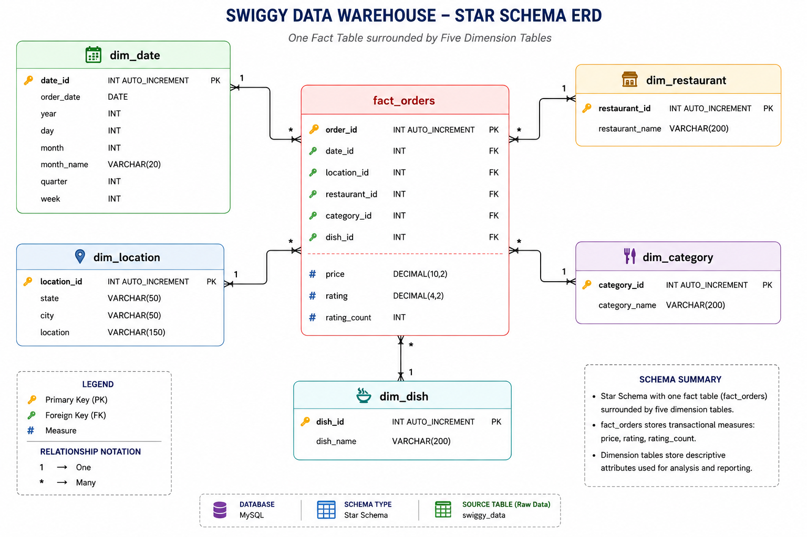

# ⭐ Data Warehouse Model

The dataset was transformed into the following Star Schema.

## ERD DIAGRAM : ⭐ STAR SCHEMA

## 📂 Dimension Tables

- `dim_date`
- `dim_location`
- `dim_restaurant`
- `dim_category`
- `dim_dish`

---

## ⭐ Fact Table

- `fact_orders`

The Fact table stores transactional measures and references each Dimension table using foreign keys.

---

# 📏 Measures

The following numeric values are stored in the Fact table and used for analysis:

- Price
- Rating
- Rating Count

---

# 🧭 Dimensions

The project analyzes data across multiple business dimensions:

- Date
- Location
- Restaurant
- Food Category
- Dish

---

# 🎯 Analytical Use Cases

The dataset can be used to answer business questions such as:

- Which restaurant has the highest average rating?
- Which city generates the highest revenue?
- Which food category is the most expensive?
- Which dishes are priced above their category average?
- How do monthly order trends change over time?
- Which restaurants contribute the highest percentage of revenue?